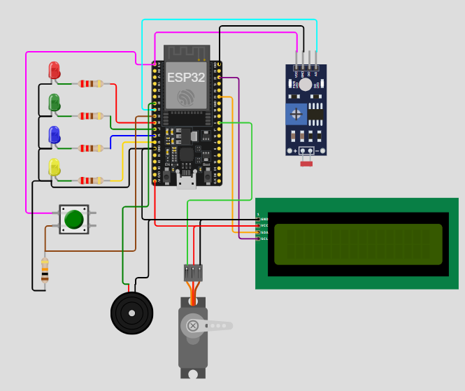

# IoT 2025 - Lab 1 Template

You need to finish following 6 exercises

### Setup Configuration in this Wokwi Project template:

- RED LED - `D26`
- Green LED - `D27`
- Blue LED - `D14`
- Yellow LED - `D12`

- Button (Active high) - `D25`
- Light sensor (analog) - `D33`

- LCD I2C - SDA: `D21`
- LCD I2C - SCL: `D22`

- Servo Motor: `D5`

- Buzzer: `D32`

## 1) Blink RED LED
- Turn **RED (D26)** ON for 500 ms, then OFF for 500 ms in a loop.  
- Serial: Print `RED ON` / `RED OFF` whenever it changes.

---

## 2) Button toggles GREEN
- Press **BUTTON (D25)** to toggle **GREEN (D27)**.  
- Serial: Print `GREEN=1` or `GREEN=0` only when the state changes.

---

## 3) Read light sensor
- Every 500 ms, read **LIGHT (D33)** using `analogRead()`.  
- Serial: Print the raw value, e.g. `raw=1835`.

---

## 4) Light sensor -> LED band
- Read **LIGHT (D33)** and turn ON exactly one LED based on value (0–4095):  
  - 0–1023 → **BLUE (D14)**  
  - 1024–2047 → **GREEN (D27)**  
  - 2048–3071 → **YELLOW (D12)**  
  - 3072–4095 → **RED (D26)**  
- Serial: Print `band=BLUE/GREEN/YELLOW/RED`.

---

## 5) Snapshot on button
- Do nothing until **BUTTON (D25)** is pressed.  
- On press, read **LIGHT (D33)** once and print `snapshot=xxxx`.  
- Flash **YELLOW (D12)** for 100 ms to acknowledge (change 100ms if needed)

---

## 6) Minimal serial control
- If serial receives a character:  
  - `'B'` → turn **BLUE (D14)** ON  
  - `'b'` → turn **BLUE (D14)** OFF  
- Serial: Print `BLUE=1` or `BLUE=0` after each command.

